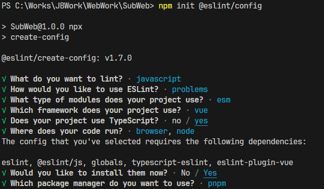

## 初始化

### 基础文件

#### `.gitignore`

```shell
# IDEA
.idea
*.iml
*.ipr
*.iws
out

# VS Code
.vscode-test

# Cloudflare
.wrangler

# Maven
target/
*.war
*.zip
#*.jar
#*.tar
#*.tar.gz
!.mvn/wrapper/*

# Eclipse
# .project
# .settings/
# .classpath
bin/
classes/
.metadata/
EclipseWork/
.externalToolBuilders/

# STS(Spring Tool Suite)
.apt_generated
.factorypath
.springBeans
.sts4-cache

# NPM
.npm
*.tgz

# Yarn
.yarn-integrity
.yarn/cache
.yarn/unplugged
.yarn/build-state.yml
.yarn/install-state.gz
.pnp.*

# Grunt
.grunt

# Bower
bower_components

# Log
logs
*.log
npm-debug.log*
yarn-debug.log*
yarn-error.log*
lerna-debug.log*
.pnpm-debug.log*

# Operational data
pids
*.pid
*.seed
*.pid.lock

# Dependency directories
node_modules/
jspm_packages/

# Snowpack dependency directory
web_modules/

# Python cache
__pycache__

# TypeScript cache
*.tsbuildinfo

# Optional eslint cache
.eslintcache

# Optional stylelint cache
.stylelintcache

# Microbundle cache
.rpt2_cache/
.rts2_cache_cjs/
.rts2_cache_es/
.rts2_cache_umd/

# Parcel-bundler cache
.cache
.parcel-cache

# Gatsby cache
.cache/

# Temp and cache
.temp

# FuseBox cache
.fusebox/

# Compiled binary addons
dist
build/Release

# Next.js build output
.next

# Nuxt.js build output
.nuxt

# Vuepress build output
.vuepress/dist

# OS Temp
.DS_Store
Thumbs.db
ehthumbs.db

# Diagnostic reports
report.[0-9]*.[0-9]*.[0-9]*.[0-9]*.json

# TernJS port file
.tern-port

# DynamoDB Local files
.dynamodb/

# Optional REPL history
.node_repl_history

# Serverless directories
.serverless/

# Node-waf configuration
.lock-wscript

# Nyc test coverage
.nyc_output

# Coverage directory used by tools like istanbul
*.lcov
coverage

# Directory for instrumented libs generated by jscoverage/JSCover
lib-cov
```

#### `.gitattributes`

```shell
# 自动判断是否为文本文件,如果是则指定换行符类型,否则不处理
* text=auto eol=lf

# 将以下文件视为二进制文件,不处理
*.db binary
*.jar binary
*.png binary
*.jpg binary
*.zip binary
*.exe binary

# 将 .txt 文件视为文本文件,并指定换行符类型
*.md text eol=crlf

# 将 .txt 文件视为文本文件,并指定换行符类型
*.txt text eol=crlf

# 将 .cmd 文件视为文本文件,并指定换行符类型
*.cmd text eol=crlf
```

### 基础规则

#### `.editorconfig`

```shell
# 顶层配置标识
root = true

[*]
# 字符编码
charset = utf-8
# 缩进大小
indent_size = 2
# 缩进风格
indent_style = space
# 换行符类型
end_of_line = lf
# 最大行长度
max_line_length = 150
# 是否文件末尾插入空行
insert_final_newline = true
# 是否去除行尾多余空格
trim_trailing_whitespace = true

# 精准配置覆盖顶层配置
[*.md]
end_of_line = crlf

[*.txt]
end_of_line = crlf

# unset:放弃配置约束
[*.py]
indent_size = unset

[*.ui]
indent_size = unset

[*.xml]
indent_size = unset

[*.java]
indent_size = unset
```

### ESLint&Prettier

```js
// 初始化项目
pnpm init
// 初始化ESLint
npm init @eslint/config
// 初始化Prettier(参考https://www.npmjs.com/package/eslint-plugin-prettier)
pnpm i --D --save-exact prettier
pnpm i --D eslint-plugin-prettier eslint-config-prettier
// 添加Vue解析(参考https://www.npmjs.com/package/vue-eslint-parser)
pnpm i --D vue-eslint-parser
```



---

#### `eslint.config.mjs`

> 规则从下往上覆盖

```js
import { defineConfig } from 'eslint/config'
import globals from 'globals'
import pluginJS from '@eslint/js'
import pluginTS from 'typescript-eslint'
import pluginVue from 'eslint-plugin-vue'
import parserVue from 'vue-eslint-parser'
import eslintPluginPrettierRecommended from 'eslint-plugin-prettier/recommended'

export default defineConfig([
  {
    ignores: [
      'dist',
      'src/static',
      'node_modules',
      'src/pages.json',
      'src/uni_modules',
      'src/manifest.json',
      '*.svg',
      '*.d.ts',
      '*.min.js',
      'build/*.js',
      'logs',
      '*.log',
      '.husky'
    ]
  },
  {
    languageOptions: {
      globals: {
        ...globals.node,
        ...globals.browser
      },
      ecmaVersion: 2021,
      sourceType: 'module'
    }
  },
  pluginJS.configs.recommended,
  ...pluginTS.configs.recommended,
  ...pluginVue.configs['flat/essential'],
  {
    files: ['*.js', '**/*.js'],
    rules: {
      '@typescript-eslint/no-require-imports': 'off' // 允许 require 导入
    }
  },
  {
    files: ['*.ts', '**/*.ts'],
    languageOptions: {
      parser: pluginTS.parser,
      ecmaVersion: 'latest',
      sourceType: 'module'
    },
    rules: {
      '@typescript-eslint/no-explicit-any': 'off', // 允许 any
      '@typescript-eslint/no-empty-function': 'off', // 允许空函数
      '@typescript-eslint/no-empty-object-type': 'off' // 允许空对象
    }
  },
  {
    files: ['*.vue', '**/*.vue'],
    languageOptions: {
      parser: parserVue,
      ecmaVersion: 'latest',
      sourceType: 'module',
      parserOptions: {
        parser: pluginTS.parser,
        ecmaFeatures: {
          globalReturn: false,
          impliedStrict: false,
          jsx: true
        }
      }
    }
  },
  eslintPluginPrettierRecommended,
  {
    rules: {
      'no-console': process.env.NODE_ENV === 'production' ? 'warn' : 'off',
      'no-debugger': process.env.NODE_ENV === 'production' ? 'warn' : 'off'
    }
  }
])
```

#### `.prettierrc`

```shell
{
  "tabWidth": 2,
  "useTabs": false,
  "endOfLine": "lf",
  "printWidth": 150,
  "semi": false,
  "singleQuote": true,
  "jsxSingleQuote": false,
  "quoteProps": "as-needed",
  "trailingComma": "none",
  "bracketSpacing": true,
  "bracketSameLine": false,
  "singleAttributePerLine": false,
  "arrowParens": "always",
  "proseWrap": "preserve",
  "embeddedLanguageFormatting": "auto",
  "htmlWhitespaceSensitivity": "ignore",
  "vueIndentScriptAndStyle": true
}
```

#### `.prettierignore`

```shell
dist
src/static
node_modules
src/pages.json
src/uni_modules
src/manifest.json

*.svg
*.d.ts
*.min.js
build/*.js

logs
*.log

.husky
```

### Stylelint

```js
pnpm i -D postcss postcss-html postcss-scss stylelint stylelint-config-recommended
pnpm i -D stylelint-config-recommended-scss stylelint-config-recommended-vue stylelint-config-html
pnpm i -D stylelint-prettier stylelint-config-recess-order
```

#### `.stylelintrc.json`

```json
{
  "extends": [
    "stylelint-config-recommended",
    "stylelint-config-recommended-scss",
    "stylelint-config-recommended-vue/scss",
    "stylelint-config-html/vue",
    "stylelint-config-recess-order"
  ],
  "plugins": ["stylelint-prettier"],
  "overrides": [
    {
      "files": ["**/*.{css,scss}"],
      "customSyntax": "postcss-scss"
    },
    {
      "files": ["**/*.{vue,html}"],
      "customSyntax": "postcss-html"
    }
  ],
  "rules": {
    "import-notation": "string",
    "selector-class-pattern": null,
    "custom-property-pattern": null,
    "keyframes-name-pattern": null,
    "no-descending-specificity": null,
    "no-empty-source": null,
    "selector-pseudo-class-no-unknown": [
      true,
      {
        "ignorePseudoClasses": ["global", "export", "deep"]
      }
    ],
    "unit-no-unknown": [
      true,
      {
        "ignoreUnits": ["rpx"]
      }
    ],
    "property-no-unknown": [
      true,
      {
        "ignoreProperties": []
      }
    ],
    "at-rule-no-unknown": [
      true,
      {
        "ignoreAtRules": ["apply", "use", "forward"]
      }
    ]
  }
}
```

#### `.stylelintignore`

```shell
dist
src/static
node_modules
src/pages.json
src/uni_modules
src/manifest.json

*.svg
*.d.ts
*.min.js
build/*.js

logs
*.log

.husky
```

### Webpack

```js
pnpm i -D webpack webpack-cli typescript ts-loader
pnpm i -D clean-webpack-plugin html-webpack-plugin mini-css-extract-plugin css-minimizer-webpack-plugin node-polyfill-webpack-plugin copy-webpack-plugin terser-webpack-plugin
pnpm i -D css-loader less-loader
pnpm i -D cross-env
```

#### `tsconfig.json`

```json
{
  "include": ["src"],
  "exclude": ["node_modules"],
  "compilerOptions": {
    "module": "ESNext",
    "target": "es6",
    "lib": ["ESNext", "DOM"],
    "moduleResolution": "Node",
    "strict": true,
    "removeComments": true,
    "allowSyntheticDefaultImports": true
  }
}
```

#### `webpack.config.js`

```js
const path = require('path')
const { CleanWebpackPlugin } = require('clean-webpack-plugin')
const HTMLWebpackPlugin = require('html-webpack-plugin')
const MiniCssExtractPlugin = require('mini-css-extract-plugin')
const CSSMinimizerPlugin = require('css-minimizer-webpack-plugin')
const NodePolyfillPlugin = require('node-polyfill-webpack-plugin')
const CopyPlugin = require('copy-webpack-plugin')
const TerserPlugin = require('terser-webpack-plugin')

module.exports = {
  entry: './src/index.ts',
  output: {
    path: path.resolve(__dirname, 'dist'),
    filename: './js/[name].js'
  },
  mode: process.env.NODE_ENV,
  module: {
    rules: [
      {
        test: /\.ts$/,
        use: 'ts-loader',
        exclude: /node-moudles/
      },
      {
        test: /\.css$/,
        use: [
          MiniCssExtractPlugin.loader,
          {
            loader: 'css-loader',
            options: {
              url: false
            }
          }
        ],
        exclude: /node-moudles/
      },
      {
        test: /\.less$/,
        use: [
          MiniCssExtractPlugin.loader,
          {
            loader: 'css-loader',
            options: {
              url: false
            }
          },
          'less-loader'
        ],
        exclude: /node-moudles/
      }
    ]
  },
  plugins: [
    new CleanWebpackPlugin(),
    new HTMLWebpackPlugin({
      template: './public/index.html'
    }),
    new MiniCssExtractPlugin({
      filename: 'css/[name].css'
    }),
    new CSSMinimizerPlugin(),
    new NodePolyfillPlugin(),
    new CopyPlugin({
      patterns: [{ from: 'public/favicon.ico', to: 'favicon.ico' }]
    })
  ],
  resolve: {
    extensions: ['.ts', '...']
  },
  optimization: {
    splitChunks: {
      chunks: 'all',
      cacheGroups: {
        vendors: {
          test: /node_modules/,
          filename: 'js/chunk-vendor.[name].js'
        }
      }
    },
    minimize: true,
    minimizer: [
      new TerserPlugin({
        terserOptions: {
          toplevel: true
        },
        extractComments: false
      })
    ]
  }
}
```

### VsCode

#### `.vscode/settings.json`

```json
{
  "eslint.run": "onSave",
  "eslint.useFlatConfig": true,
  "editor.codeActionsOnSave": {
    "source.fixAll.eslint": "explicit",
    "source.fixAll.stylelint": "explicit"
  },
  "eslint.validate": [
    "javascript",
    "vue",
    "vue-html",
    "typescript",
    "typescriptreact",
    "html",
    "css",
    "scss",
    "less",
    "json",
    "jsonc",
    "json5",
    "markdown"
  ],
  "stylelint.validate": ["css", "scss", "sass", "less", "postcss", "vue", "html"],
  "explorer.fileNesting.enabled": true,
  "explorer.fileNesting.expand": false,
  "explorer.fileNesting.patterns": {
    ".gitignore": ".gitattributes",
    ".editorconfig": "eslint.config.mjs, .prettierrc, prettier.config.mjs, .prettierignore, .stylelintrc.json, stylelint.config.mjs, .stylelintignore"
  }
}
```
